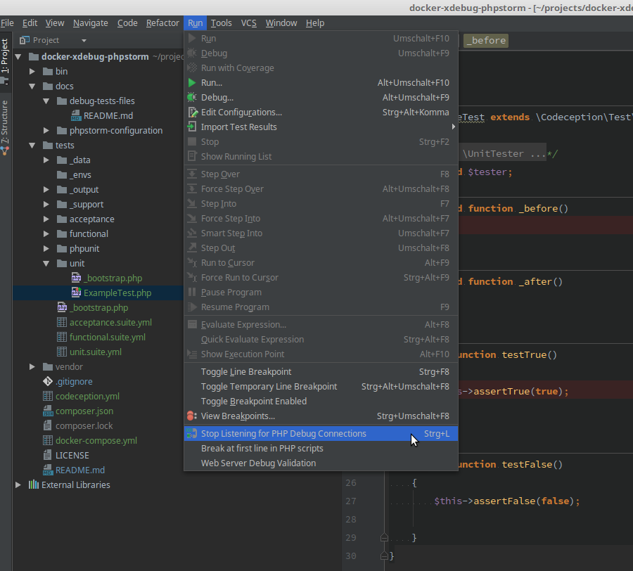
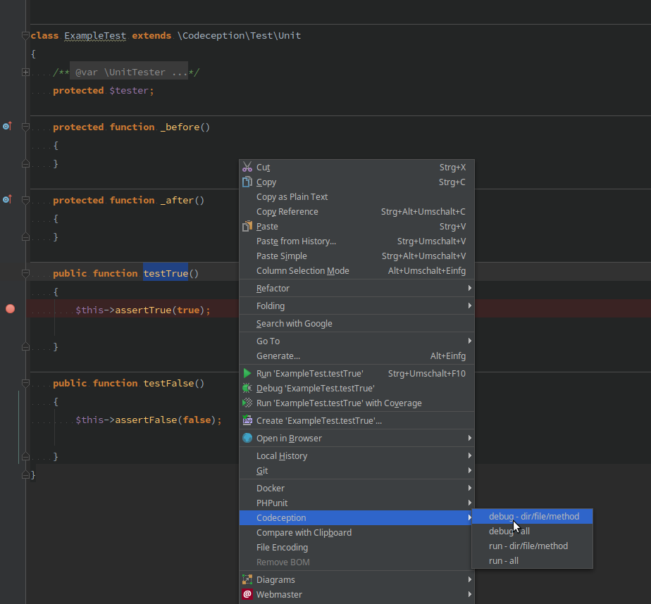
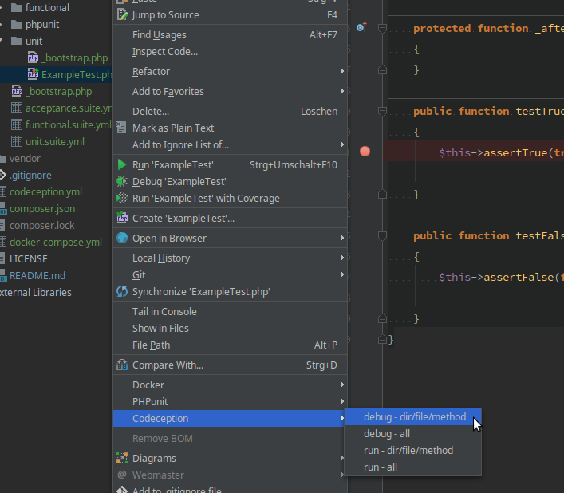
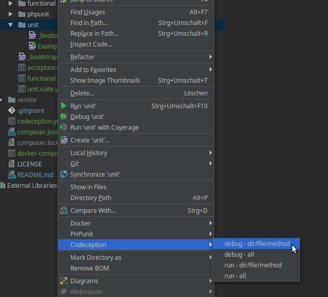

# How to debug with PHPStorm
Let's get practical.

First listen for incoming debugging sessions.

### Debug a single method
Just double click the methods name so it is fully selected. Then make a right click and select your external tool to run a single file or method.

The currently opened file will be passed as well as the method you've selected.

### Debug a single file
Simply open the file, make a right click and select your external tool to run a single file or method.
The currently opened file will be passed via PHPStorm variable to the run command.

### Debug all files from a directory
Simply open the file navigator and right click on the directory you want. The select your external tool to run a single file or method.
The directory will be passed via `--file=` and all tests within this directory will be executed.

### Debug all files/tests
Click right anywhere in your code or open the "Tools" menu from the main menu and select your external tool to run all files/tests.