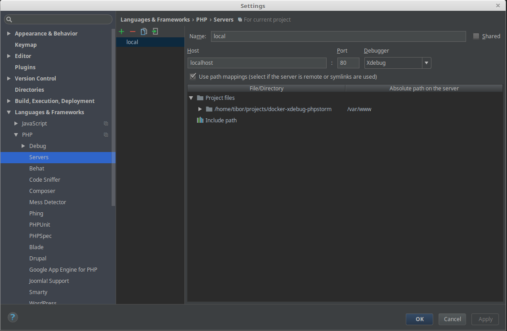
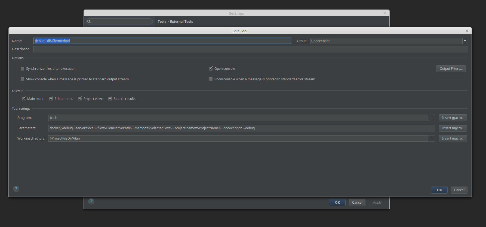

# How to configure PHPStorm

### Create a server
Open "Settings > Languages & Framework > PHP > Servers", add a new server and configure the path mapping.

### Create a new external tool.
Open "Settings > Tools > External Tools".
Set the name/group as you want.

_Tool settings_
- Program: bash
- Parameters: `docker_xdebug --server=<your server name> --file=$FileRelativePath$ --method=$SelectedText$ --container=<container name> --codeception --debug`
- Working directory: $ProjectFileDir$/bin

The options `--file=$FileRelativePath$` and `--method=$SelectedText$` are necessary for directory/file/method debugging.
If you want to run/debug all tests then create another external tool and omit the options.

### Example external tools
codeception - debug - dir/file/method

`docker_xdebug --server=<your server name> --file=$FileRelativePath$ --method=$SelectedText$ --container=<container name> --codeception --debug`

codeception - debug - all

`docker_xdebug --server=<your server name> --container=<container name> --codeception --debug`

codeception - run - dir/file/method

`docker_xdebug --server=<your server name> --file=$FileRelativePath$ --method=$SelectedText$ --container=<container name> --codeception`

codeception - run - all

`docker_xdebug --server=<your server name> --container=<container name> --codeception`
